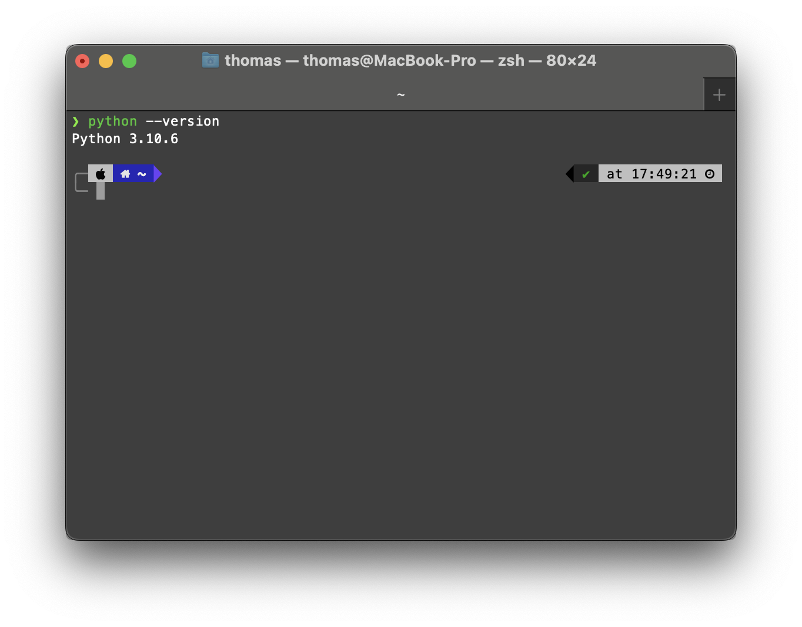

# Installation of Python (WS22)

In this lecture we use Python 3.10 as our programming language. This guide follows the steps for installing python 3.10 for Windows, macOS and Debian Linux. 


## Windows

Download the installer here:
* [Windows (64-bit)](https://www.python.org/ftp/python/3.10.7/python-3.10.7-amd64.exe)
* [Windows (32-bit)](https://www.python.org/ftp/python/3.10.7/python-3.10.7.exe)


1. Open the downloaded Python installer.   
**Make sure to check the "Add Python 3.10 to PATH" mark!**


2. Click on "Install Now". This may take a while.


3. To finish the installation, click "Close".


### Verify Installation
To check if you successfully installed Python open up a new Terminal. Press the Windows key<kbd></kbd>, type `cmd` and hit enter. 

A new terminal window opens up which should look something like this:


Next, enter ``python --version`` in the terminal and hit enter.


You should see the currently installed version of Python.

## macOS
You can install python using **either** the installer package <span style="color:red">**OR**</span> homebrew.
#### Using the installer package (.pkg)
Download the installer here
* [macOS 11](https://www.python.org/ftp/python/3.10.7/python-3.10.7-macos11.pkg)

1. Open the downloaded installer package, click on "Continue" and accept the licence


2. Click on "Install"


3. Finish the installation


#### Using homebrew
[Homebrew](https://brew.sh) is a free software package manager that can be installed by pasting the following line into the terminal (To open a terminal, press <kbd>&#8984;</kbd>+<kbd>Space</kbd>, type `Terminal` and hit enter)

>``/bin/bash -c "$(curl -fsSL https://raw.githubusercontent.com/Homebrew/install/HEAD/install.sh)"``

You might need to install Xcode command line tools first, by typing the following line into your terminal
>``xcode-select --install``

You can install python 3.10 by typing
>``brew update && brew install python@3.10``

**Optional**: You might want to add symbolik links like python->python3 and pip->pip3 to your Path by typing


> ``echo -n 'export PATH=/opt/homebrew/opt/python@3.10/libexec/bin:$PATH' >> ~/.zshrc``
### Verify installation
Open a terminal (To open a terminal, press <kbd>&#8984;</kbd>+<kbd>Space</kbd> and type `Terminal`), type `python --version` and hit enter.


If an error is displayed like `command not found: python`, try `python3 --version` instead.
## Debian
If you are using a Linux-distribution based on Debian (like Ubuntu), type the following lines into a terminal (The keyboard sequence to open a terminal in Linux usually is <kbd>Ctr</kbd>+<kbd>Alt</kbd>+<kbd>T</kbd>):
```bash
sudo apt update && sudo apt upgrade -y
sudo apt install software-properties-common -y
sudo add-apt-repository ppa:deadsnakes/ppa
sudo apt install python3.10
```


### Verify python installation
```bash
python3.10 --version
3.10.7
```
# Installation of Jupyter Lab

In the lecture and homeworks we use Jupyter Lab. To install it, open a terminal and enter ``pip install jupyterlab`` (Hint for macOS/Linux users: if this doesn't work, try ``pip3 install jupyterlab``. 


To open Jupyter Lab, type ``jupyter lab`` in your terminal. A new browser window pops up with jupyter lab running in the localhost. Don't close your terminal while working in jupyter lab. ([Here](https://jupyterlab.readthedocs.io/en/latest/user/interface.html) is the documentation of the Jupyter Lab Interface and how to use it)

# IDE
To write your own python code outside jupyter lab you can use any texeditor but we recommend to use an IDE (integrated development enviornment) which provides better syntax highlighting, text editing, debugging and many other helpful features.  
Some common IDEs:
* [Visual Studio Code](https://code.visualstudio.com/) (recommended)
* [Pycharm](https://www.jetbrains.com/de-de/pycharm/)
* [Sublime Text](https://www.sublimetext.com/)


# Success?

Was your python installation successful? 🐍

If you encountered any problems, please post your problems in the Moodle forum.

